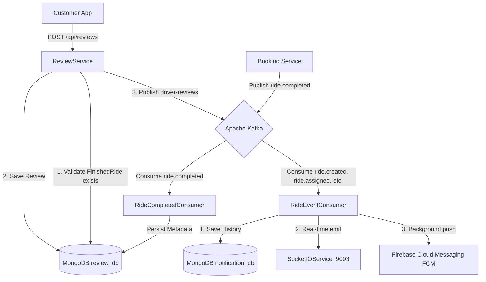
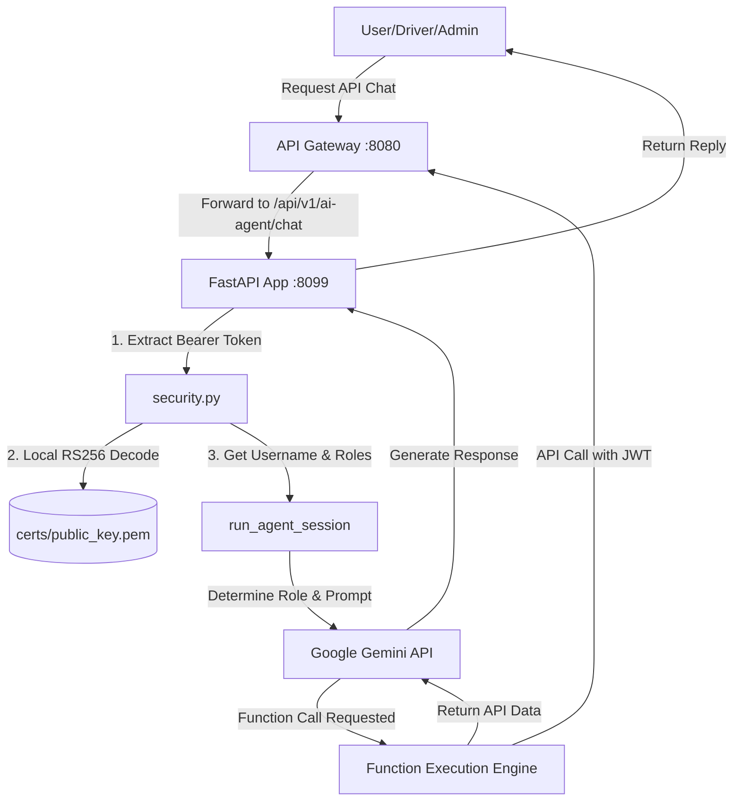

# BÁO CÁO KIẾN TRÚC HỆ THỐNG: NOTIFICATION, REVIEW & AI AGENT SERVICE

Tài liệu này tổng hợp toàn bộ luồng hoạt động, cách đăng ký dịch vụ, cơ chế phân quyền bảo mật bằng mã JWT, quy trình lắng nghe sự kiện trên Apache Kafka, và phân tích chuyên sâu về **AI Agent Service (Gemini-based LLM)** phục vụ hệ thống CAB Booking.

---

## PHẦN I: NOTIFICATION SERVICE & REVIEW SERVICE

Hệ thống đặt xe công nghệ CAB Booking được xây dựng dựa trên kiến trúc **Microservices** kết hợp **Event-Driven Architecture (EDA)**. Hai dịch vụ `notification-service` và `review-service` đóng vai trò quan trọng trong việc truyền tải trạng thái thời gian thực và ghi nhận đánh giá trải nghiệm của khách hàng.

### 1. Đăng ký Dịch vụ trên Eureka Server
Cả hai dịch vụ đều tích hợp **Spring Cloud Netflix Eureka Client** để tự động định danh và thông báo trạng thái hoạt động với **Eureka Server** (chạy tại cổng `8761`).

*   **Eureka Server URL:** `http://eureka-server:8761/eureka/`
*   **notification-service:**
    *   **Cổng API nội bộ (REST):** `8092`
    *   **Cổng Socket.IO Server:** `9093`
    *   **Định danh trên Eureka:** `NOTIFICATION-SERVICE`
*   **review-service:**
    *   **Cổng API nội bộ:** `8091`
    *   **Định danh trên Eureka:** `REVIEW-SERVICE`

> [!NOTE]
> Khi Gateway hoặc các dịch vụ khác giao tiếp với 2 service này, chúng không gọi trực tiếp thông qua IP/cổng tĩnh, mà gọi qua cơ chế cân bằng tải động của **Spring Cloud Gateway** thông qua Service ID đăng ký trên Eureka (Ví dụ: `lb://notification-service`, `lb://review-service`).

---

### 2. Quản lý Cấu hình Tập trung (Spring Cloud Config)
Cả hai dịch vụ đều thiết lập Stateless và cấu hình của chúng được tải động từ **Config Server** (cổng `8888`) tại thời điểm khởi động thông qua cơ chế native repository.
*   **notification-service** tải cấu hình từ file [notification-service.yaml](file:///d:/NAM_TU/HK2/KTPM/BC/GIT/test/Nhom13_KTTKPM_DHKTPM18A/cab_booking/cab-booking-config/notification-service.yaml).
*   **review-service** tải cấu hình từ file [review-service.yaml](file:///d:/NAM_TU/HK2/KTPM/BC/GIT/test/Nhom13_KTTKPM_DHKTPM18A/cab_booking/cab-booking-config/review-service.yaml).

---

### 3. Cơ chế Phân quyền & Xác thực bằng JWT
Hệ thống sử dụng cơ chế bảo mật cổng tập trung qua Gateway kết hợp xác thực phân tán ở từng microservice:
*   Cả hai service đều phụ thuộc vào thư viện nội bộ `iuh.fit:common` để thiết lập Spring Security và bộ lọc JWT Filter.
*   **Bảo mật JWT:** Mã JWT được ký bằng thuật toán khóa bất đối xứng **RS256** từ `auth-service`. Các service con sử dụng khóa công khai RSA (Public Key) để giải mã và kiểm tra tính hợp lệ của Token mà không cần gọi lại `auth-service` (Stateless Auth).
*   **Ngoại lệ (Public Endpoints):** Các endpoint phục vụ giám sát và tài liệu mã nguồn mở được cấu hình bỏ qua xác thực JWT:
    *   `/actuator/health`, `/actuator/info` (Giám sát trạng thái bởi Docker Compose/Eureka).
    *   `/v3/api-docs/**`, `/swagger-ui/**`, `/swagger-ui.html` (Mã nguồn tài liệu API).

---

### 4. Cơ chế Hoạt động chi tiết & Lắng nghe Sự kiện trên Kafka

#### A. Notification Service
*   **Database:** MongoDB (`mongodb://mongodb:27017/notification_db`) để lưu trữ lịch sử thông báo của người dùng với tốc độ ghi cực nhanh.
*   **Cơ chế Lắng nghe Kafka:**
    *   **Group ID:** `notification-group`
    *   **Topics lắng nghe:** `ride.created`, `ride.assigned`, `ride.accepted`, `ride.rejected`, `ride.completed`, `ride.arrived`, `ride.started`, `booking-events`, `booking.timeout`, `payment.completed`.
    *   **Hoạt động:** Khi có bất kỳ sự thay đổi trạng thái nào trong vòng đời chuyến đi phát lên Kafka, `RideEventConsumer` sẽ đón nhận sự kiện, chuyển đổi dữ liệu, lưu lịch sử vào MongoDB và đồng thời thực hiện:
        1.  **Thông báo Foreground (Thời gian thực):** Phát qua cổng Socket.IO `9093` vào Room tương ứng với `bookingId` của chuyến đi (sử dụng sự kiện `new_notification` và `booking_status_update`). Cả Khách hàng và Tài xế trong cùng một phòng sẽ ngay lập tức nhận được thông tin để đồng bộ hóa UI.
        2.  **Thông báo Background (Đẩy từ xa):** Nếu ứng dụng khách đang bị ẩn hoặc tắt màn hình, hệ thống sẽ đẩy thông báo qua Firebase Cloud Messaging (FCM) dựa trên Token thiết bị đã được đăng ký trước đó.

#### B. Review Service
*   **Database:** MongoDB (`mongodb://mongodb:27017/review_db`) để lưu trữ và quản lý các đánh giá dạng phi cấu trúc.
*   **Ràng buộc Nghiệp vụ cốt lõi (Review Eligibility):**
    *   *Sự cố nghiệp vụ:* Khách hàng không thể tự tiện đánh giá một cuốc xe chưa diễn ra hoặc đang chạy.
    *   *Giải pháp xử lý:* `review-service` duy trì một Collection có tên là `FinishedRide` trong MongoDB. 
    *   *Luồng đồng bộ:* Khi và chỉ khi chuyến đi được tài xế kết thúc thành công, `booking-service` sẽ phát sự kiện `ride.completed` lên Kafka. `RideCompletedConsumer` của `review-service` lắng nghe sự kiện này và lưu ngay mã `rideId` cùng `customerId` và `driverId` vào bảng `FinishedRide`.
    *   *Xác thực tạo Review:* Khi người dùng gọi API `POST /api/reviews` để gửi đánh giá, `ReviewService` bắt buộc kiểm tra sự tồn tại của `rideId` trong bảng `FinishedRide` thông qua `finishedRideRepository.existsById(review.getRideId())`. Nếu không tồn tại (ngoại trừ mã mock đặc biệt `booking-mock-123`), hệ thống sẽ lập tức chặn đứng và ném ra ngoại lệ:
        `"Cannot review a ride that is not finished or does not exist: {rideId}"`
    *   *Phát sự kiện cập nhật điểm tài xế:* Sau khi review được tạo và lưu thành công, hệ thống phát một sự kiện mới lên Kafka topic `driver-reviews` chứa thông tin rating mới. `driver-service` sẽ đón sự kiện này để cập nhật điểm sao trung bình (`averageRating`) và tổng số chuyến đi của tài xế đó theo thời gian thực.

---

## PHẦN II: DEEP DIVE AI AGENT SERVICE

`ai-agent-service` là một dịch vụ thông minh được phát triển bằng ngôn ngữ **Python (FastAPI)**, tích hợp sâu vào kiến trúc hệ thống để cung cấp trợ lý đắc lực cho Khách hàng, Tài xế và Quản trị viên.

### 1. Dòng Model & Kiến trúc Tích hợp
*   **Dòng Model sử dụng:** Ưu tiên sử dụng dòng mô hình hiệu năng cao **Gemini 2.5 Flash** (với các mô hình dự phòng bao gồm `gemini-2.0-flash` và `gemini-2.5-flash-lite`) thông qua thư viện chính thức `google-generativeai`.
*   **Kiến trúc dịch vụ:** Chạy độc lập tại cổng `8099`, định tuyến thông qua API Gateway tại route `/api/v1/ai-agent/**`.
*   **Xác thực JWT nội bộ:** 
    *   AI Agent tự động kiểm tra tính toàn vẹn của mã JWT bằng cách giải mã trực tiếp chữ ký số **RS256** thông qua tệp khóa công khai dùng chung nằm tại `certs/public_key.pem`.
    *   Sau khi giải mã thành công, AI Agent trích xuất:
        *   `sub` claim làm định danh tài khoản (`username`).
        *   `role`, `scope`, hoặc `authorities` làm thông tin phân quyền (`roles`).
    *   Dữ liệu này được chuyển thành đối tượng `user_info` truyền vào phiên làm việc AI, đảm bảo AI luôn nhận thức chính xác danh tính và quyền hạn của người đang chat.

---

### 2. Thiết kế Vai trò (Role-Based) & Tool-Calling Đặc quyền
AI Agent sử dụng kiến trúc **Role-Based System Instructions** kết hợp **Function Calling (Tool-Calling)** để ngăn chặn việc rò rỉ quyền hạn giữa các nhóm người dùng:

| Vai trò người dùng | Quyền hạn & Chỉ dẫn hệ thống | Tool được phép sử dụng (Tools Map) | Service đích được gọi qua Gateway |
| :--- | :--- | :--- | :--- |
| **ROLE_USER** *(Khách hàng)* | Tra cứu giá xe, hướng dẫn đặt xe, hỗ trợ hotline. Trả lời lịch sự, thân thiện. Tuyệt đối không được tạo cuốc trực tiếp để tránh đặt nhầm cho khách hàng. | `calculate_fare` | `pricing-service` |
| **ROLE_DRIVER** *(Tài xế)* | Trợ lý vận hành và an toàn. Trả lời siêu ngắn gọn (gạch đầu dòng, tối đa 3 ý, mỗi ý < 12 từ) để tránh tài xế mất tập trung khi lái xe. Luôn nhắc nhở an toàn. | `check_driver_earnings_report`, `get_active_hotspots` | `driver-service`, `pricing-service` |
| **ROLE_ADMIN** *(Quản trị viên)* | Trợ lý phân tích, giám sát số liệu vận hành và doanh thu thời gian thực, tỉ lệ hủy cuốc, phát hiện tuyến đường có tỉ lệ hủy cao. | `get_system_dashboard_stats`, `get_high_canceled_routes` | `booking-service`, `driver-service`, `pricing-service` |

#### Hàng rào Bảo mật Cứng (Hard Security Boundaries):
1.  **Chặn trước khi gọi LLM:** Nếu một tin nhắn chứa các từ khóa yêu cầu quản trị (như dữ liệu doanh thu tổng, tỉ lệ hủy...) nhưng vai trò của người dùng không phải là `ROLE_ADMIN`, hệ thống lập tức ném ra ngoại lệ `PermissionError("Bạn không có quyền sử dụng công cụ quản trị hệ thống.")` ngay ở tầng Python mà không gửi yêu cầu lên API của Google, giúp tiết kiệm chi phí và tăng tính bảo mật.
2.  **Bộ lọc Tool khi chạy LLM:** Trong vòng lặp Function Calling, nếu mô hình sinh ra một yêu cầu gọi công cụ nằm ngoài danh sách đặc quyền của Role đó (`active_tools`), AI Agent sẽ chặn đứng cuộc gọi và phản hồi: `"Lỗi bảo mật: Bạn không được phép sử dụng công cụ {name}."`
3.  **Hàng rào dự phòng cục bộ (Fallback catching engine):** Nếu cuộc gọi API Gemini bị lỗi hoặc vượt quá giới hạn (Rate Limits), bộ lọc cục bộ bằng mã cứng (rule-based) sẽ kích hoạt để trả lời thông minh dựa trên vai trò của người dùng và chặn các câu hỏi nhạy cảm liên quan đến mật khẩu hoặc cố tình leo thang quyền hạn.

---

### 3. Phân tích Chuyên sâu kiến trúc Stateless (Không lưu Context)

Hệ thống AI Agent của CAB Booking được chủ động thiết kế theo mô hình **Stateless (Không lưu lại lịch sử hội thoại liên tiếp)**. Đây là một quyết định kiến trúc mang tính chiến lược dựa trên các luận điểm sau:

#### Luận điểm 1: Đặc thù của Nghiệp vụ Đặt xe (Transaction-based Business Logic)
Ứng dụng đặt xe công nghệ hoạt động dựa trên các phiên giao dịch độc lập và tức thì. Khi khách hàng mở khung chat với AI, họ thường chỉ có một mục đích duy nhất và cực kỳ rõ ràng: *Nhập điểm đi/điểm đến để hỏi giá cước hoặc yêu cầu trợ giúp số hotline.* Khi nhu cầu đó kết thúc (hoặc được chuyển đổi thành Popup đặt xe tự động trên màn hình di động), phiên chat đó coi như đã hoàn thành nhiệm vụ. Việc lưu trữ và gửi kèm một lịch sử hội thoại dài hạn là hoàn toàn không mang lại giá trị thực tiễn cho nghiệp vụ đặt xe, khác biệt hoàn toàn so với các chatbot tâm sự hay trợ lý sáng tạo nội dung.

#### Luận điểm 2: Tối ưu hóa Chi phí API & Tài nguyên (Token Context Window Cost)
Khi sử dụng LLM qua API, chi phí được tính trực tiếp dựa trên số lượng Token (bao gồm cả Token đầu vào - Input và Token đầu ra - Output). Nếu chúng ta thiết kế hệ thống lưu ngữ cảnh (Stateful):
*   Lượt chat thứ 1: Gửi 50 tokens.
*   Lượt chat thứ 2: Gửi Lượt 1 + Lượt 2 = 150 tokens.
*   Lượt chat thứ N: Gửi toàn bộ lịch sử phía trước.
Số lượng Token đầu vào sẽ phình to theo **cấp số cộng**. Thiết kế Stateless giúp tối ưu hóa triệt để băng thông mạng, giảm thiểu chi phí API phải trả cho Google xuống mức cố định tối thiểu và đồng thời tối ưu hóa thời gian phản hồi (Latency) xuống mức thấp nhất, mang lại trải nghiệm phản hồi tức thì cho người dùng di động.

#### Luận điểm 3: Bảo mật Thông tin Hành trình & Quyền riêng tư (Data Privacy)
Để đảm bảo an toàn thông tin theo chuẩn dữ liệu vị trí và hành trình di chuyển của khách hàng, hệ thống chủ động không lưu lại vết các câu chat địa điểm trước đó ở tầng AI. Điều này giảm thiểu tối đa nguy cơ rò rỉ dữ liệu di chuyển cá nhân của khách hàng nếu tài khoản bị truy cập trái phép hoặc hệ thống lưu trữ log bị tấn công.

#### Luận điểm 4: Vượt qua Hạn mức Giới hạn Tài nguyên (Rate Limits & Quota Constraints)
Hệ thống hiện tại đang tích hợp dòng model hiệu năng cao **Gemini Flash** qua Google AI Studio gói **Free Tier**, vốn bị giới hạn rất chặt chẽ về:
*   **RPM (Requests Per Minute):** Số yêu cầu mỗi phút.
*   **TPM (Tokens Per Minute):** Dung lượng Token truyền tải mỗi phút.
Nếu duy trì bộ nhớ Context dài, mỗi lượt chat tiếp theo của cùng một người dùng sẽ làm dung lượng token tăng vọt, nhanh chóng chạm ngưỡng giới hạn TPM và gây ra lỗi `429 Resource Exhausted`. Thiết kế Stateless là giải pháp kỹ thuật tối ưu giúp bảo vệ hệ thống không bị nghẽn mạch, đảm ứng dụng luôn phục vụ mượt mà và ổn định cho hàng trăm người dùng cùng một lúc trong giới hạn tài nguyên cho phép.

---

### 4. Ưu điểm Nổi bật khi sử dụng Gemini Flash & LLM Tool Calling
*   **Tốc độ xử lý vượt trội:** Gemini Flash có tốc độ phản hồi cực nhanh, lý tưởng cho các tác vụ di động cần phản hồi tức thì dưới 1.5 giây.
*   **Khả năng hiểu ý định tự nhiên:** Người dùng không cần gõ câu lệnh SQL hay cú pháp phức tạp, LLM tự động trích xuất các thông số tọa độ, tên địa chỉ, loại xe từ ngôn ngữ nói tự nhiên để truyền vào các API của hệ thống một cách chính xác.
*   **Khả năng tự động gọi hàm (Native Function Calling):** LLM tự quyết định khi nào cần gọi API tính giá, khi nào cần truy vấn cơ sở dữ liệu để lấy danh sách hotspot hoặc thu nhập tài xế, tạo nên một trải nghiệm trợ lý ảo chủ động và thông minh vượt trội so với chatbot tĩnh dạng sơ đồ cây truyền thống.

---

## PHẦN III: KỊCH BẢN PHẢN BIỆN & CÂU HỎI BẢO VỆ ĐỒ ÁN (FAQ)

Dưới đây là một số kịch bản câu hỏi hóc búa từ Hội đồng phản biện và cách trả lời chuẩn xác nhất được thiết kế riêng cho hệ thống của bạn:

### ❓ Nhóm 1: Câu hỏi về Phân quyền & Bảo mật AI Agent
> **Hỏi:** *Làm thế nào để chắc chắn một tài xế hoặc một khách hàng không thể lừa AI Agent gọi API của Admin để lấy doanh thu hệ thống?*
*   **Trả lời:** 
    *   Hệ thống có **3 tầng bảo mật cứng** để chặn đứng hành vi này:
        1.  **Xác thực chữ ký JWT:** Khi request gửi đến, mã JWT được giải mã bằng Public Key RSA để lấy chính xác thông tin Role từ claim hệ thống. Thông tin này là không thể giả mạo.
        2.  **Hàng rào System Instruction & Active Tools:** AI Agent phân vùng danh sách công cụ được phép chạy theo Role thực tế. Nếu user đăng nhập bằng `ROLE_USER`, danh sách `active_tools` chỉ chứa duy nhất hàm `calculate_fare`. LLM hoàn toàn không biết đến sự tồn tại của các hàm như `get_system_dashboard_stats`.
        3.  **Kiểm tra chéo tại mã nguồn Python:** Kể cả khi LLM bị "Jailbreak" và cố tình gọi tên hàm của Admin, mã nguồn Python tại hàm `run_agent_session` sẽ đối chiếu tên hàm yêu cầu với danh sách `active_tools`. Nếu không khớp, hệ thống chặn đứng ngay lập tức và ghi log cảnh báo bảo mật.

### ❓ Nhóm 2: Câu hỏi về Sự khác biệt giữa Polling và WebSockets
> **Hỏi:** *Tại sao màn hình đặt xe (MatchingScreen) lại dùng cả Polling (5 giây/lần) lẫn Socket.IO? Dùng một cái không tốt hơn sao?*
*   **Trả lời:**
    *   Đây là thiết kế **Hybrid (Lai)** nhằm đảm bảo tính **tin cậy tối đa (High Availability & Fault Tolerance)**:
        *   **Socket.IO (Push-based):** Mang lại trải nghiệm thời gian thực cực tốt. Ngay khi tài xế từ chối/miss cuốc, máy chủ đẩy sự kiện qua socket giúp UI thay đổi trạng thái trong mili giây.
        *   **Polling (Pull-based):** Đóng vai trò là cơ chế **Fallback dự phòng**. Trong môi trường di động thực tế, kết nối 4G của khách hàng rất dễ bị ngắt quãng, mất kết nối socket tạm thời khi đi vào tầng hầm hoặc vùng sóng yếu. Việc duy trì Polling mỗi 5 giây đảm bảo nếu kết nối Socket.IO bị đứt, ứng dụng khách vẫn tự động cập nhật được trạng thái mới nhất từ API REST của `booking-service` ngay khi có mạng trở lại, tránh hiện tượng người dùng bị treo vô hạn ở một màn hình.

### ❓ Nhóm 3: Câu hỏi về Ràng buộc nghiệp vụ của Review Service
> **Hỏi:** *Tại sao không lưu trực tiếp Review vào MongoDB mà phải đẻ thêm bảng FinishedRide để kiểm tra?*
*   **Trả lời:**
    *   Đây là để đảm bảo **tính toàn vẹn dữ liệu và quy tắc nghiệp vụ (Business Rule Integrity)**.
    *   Nếu không có bảng `FinishedRide`, một người dùng xấu có thể dùng Postman hoặc công cụ can thiệp API để gửi liên tiếp hàng ngàn đánh giá giả mạo với điểm số 1 sao hoặc 5 sao cho một tài xế bằng các mã `rideId` ngẫu nhiên hoặc chưa từng hoàn thành.
    *   Bảng `FinishedRide` hoạt động như một danh sách chứng chỉ kiểm tra: Chỉ những chuyến đi thực sự đã hoàn thành (phát ra sự kiện `ride.completed` từ core booking và được xác thực) mới được phép tạo đánh giá. Điều này chặn đứng 100% các cuộc tấn công spam đánh giá giả mạo vào hệ thống tài xế.

### ❓ Nhóm 4: Câu hỏi về Kiến trúc Stateless của AI Agent
> **Hỏi:** *AI Agent không lưu lại lịch sử chat (Stateless) thì làm sao hỗ trợ được khách hàng khi họ muốn hỏi tiếp câu lệnh trước đó, ví dụ: "Chuyến đó giá bao nhiêu?" sau câu "Tính giá từ A đến B"?*
*   **Trả lời:**
    *   Chúng tôi chấp nhận sự đánh đổi này để đạt được những ưu điểm vượt trội về **chi phí API**, **bảo mật thông tin lộ trình** và đặc biệt là **tránh lỗi nghẽn tài nguyên (Rate Limit - TPM/RPM của Gemini)** đối với gói dịch vụ miễn phí.
    *   Đồng thời, trải nghiệm này được tối ưu hóa bằng thiết kế giao diện di động: Khi người dùng hỏi giá vé, thay vì bắt họ chat tiếp để đặt xe, AI Agent hướng dẫn họ gõ cú pháp chuẩn để hệ thống tự động mở một **Popup giao diện native** trên điện thoại. Khách hàng có thể tương tác trực tiếp bằng cách nhấn nút Chọn xe, Chọn cổng thanh toán trên UI native thay vì phải tiếp tục chat qua lại với AI. Điều này kết hợp hài hòa giữa sức mạnh ngôn ngữ tự nhiên của AI và sự tiện lợi, rõ ràng của giao diện người dùng truyền thống.
